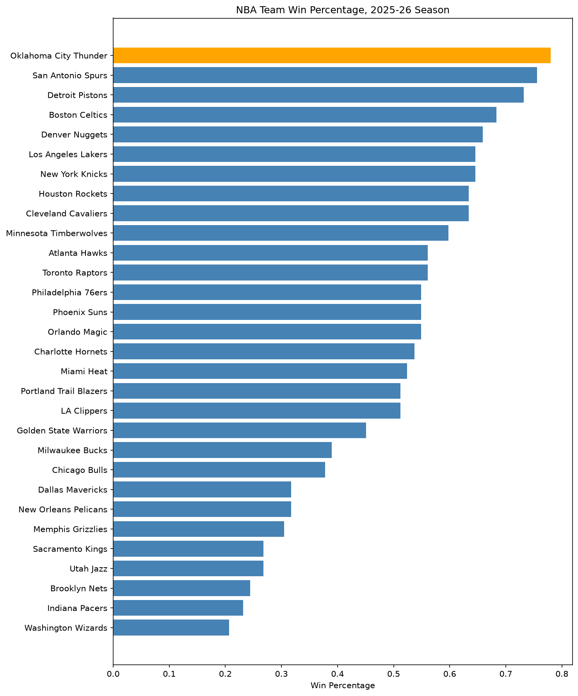
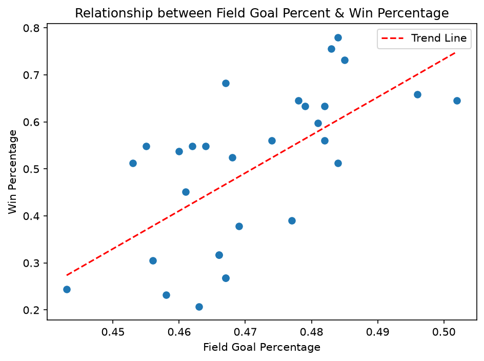
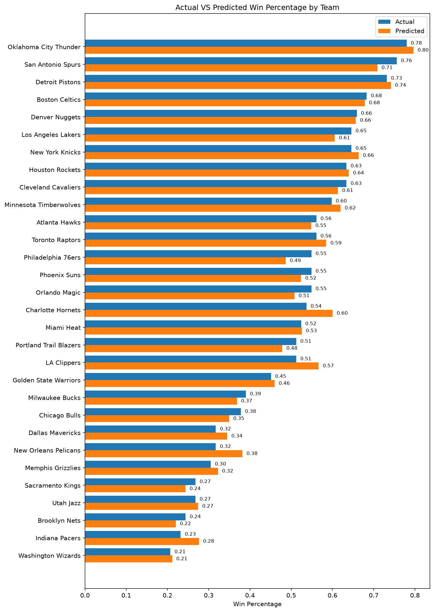
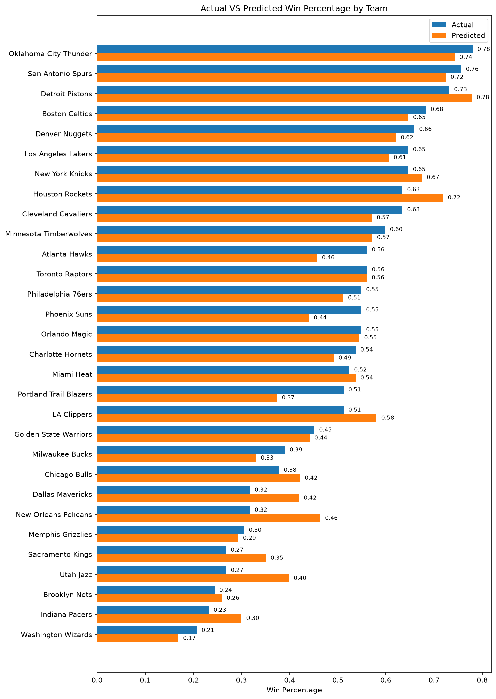
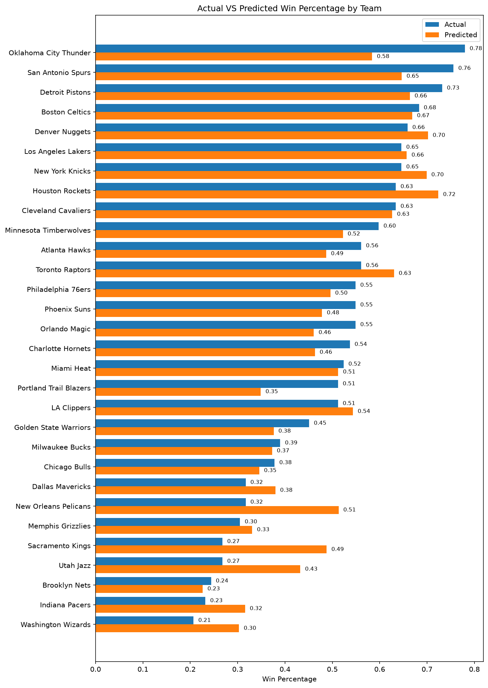
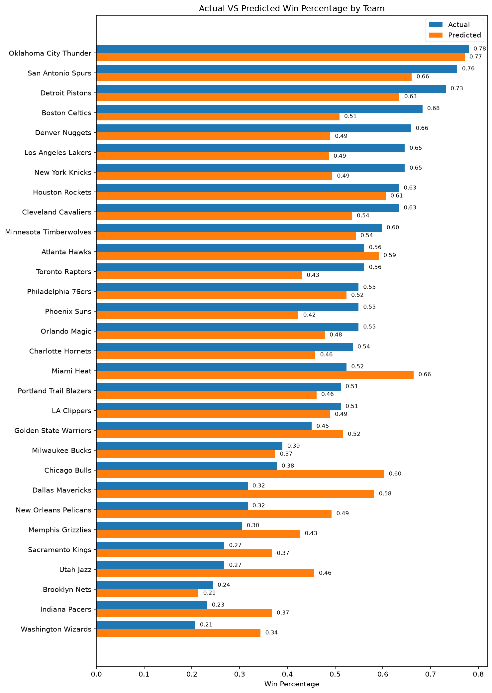

# NBA_Performance_Analysis

A statistical analysis of what stats have a greater impact in winning in the NBA, using 2025-2026 NBA team stats

## Overview

As a lifelong fan of basketball and Computer Science Student, I wanted to explore the impacts of different stats on winning in the NBA. Using current-season team data pulled from official NBA's stat API, this project builds several linear regression models to see how well different categories of stats (offensive, defensive, and overall with/without plus or minus) predict a team's win percentage

This project focuses on Explanatory Analysis, identifying which stats correlate strongest with winning in a single season rather than predicting future win percentages. More information on this can be found in the project limitations.

## Key Findings

- **Point Differential** was obviously the most accurate stat in predicting wins/losses as it's directly based off of final scores. It was found via 5-fold cross validation that R² = 0.92 indicating a very accurate prediction.
- **Offensive stats predict wins meaningfully better than defensive stats.** A model using only offensive stats (FG%, FGM, Offensive Rebounds, Assists, and Turnovers) achieved R² = 0.56, compared to R² = 0.17 for a defensive-only model (Steals, Blocks, Defensive Rebounds, and Fouls).
- **Some teams are consistently over-valued or under-valued across models .** Notably Oklahoma City, holder of the league-best record 64-18, was undervalued both offensively and defensively across both models, suggesting other factors like defensive execution (that flies under the radar when it comes to stats), depth, late-game performance, etc. that aren't fully captured in standard box-score stats. Teams like the Sacramento Kings were over-valued likely due to individual stat performances that didn't contribute to team wins at the predicted rate.

## Data Source
Team-level stats for the 2025-2026 NBA season were pulled from the nba_api Python Package, which contains official NBA stat endpoints

## Tech Stack
- **Python** -- pandas, numpy
- **Visualization** -- matplotlib
- **Modeling** -- scikit-learn (LinearRegression, cross_val_score)
- **Data source** -- nba_api

## Visualizations
**Team Win Percentage (2025-26 Season)**


**Shooting Efficency VS Win Percentage**

While the linear trend line shows some form of correlation, it is a messy relationship between field goal percentage and win percentage on its own.

**Model Predictions VS Actual Win Percentage**

Comparing actual win-percentage to model-predicted win-percentage based on different sets of stats.
- **Overall with Plus and Minus**


- **Overall without Plus and Minus**


- **Offensive**


- **Defensive**


## Model

Four separate Linear Regression models were built and evaluated using 5-fold cross-validation, each using a different set of team stats as predictors of win percentage:

|   Set     |   Stats   |   Average R²
|---|---|---|
|  Defensive Only  |  STL, BLK, DREB, PF  |  0.17  |
|  Offensive + Defensive (no Plus/Minus)  |  FG_PCT, REB, AST, TOV, STL, BLK  |  0.54  |
|  Offensive Only  |  FG_PCT, OREB, AST, TOV, FGM  |   0.56  |
|  Offensive + Defensive (with Plus/Minus)  |   FG_PCT, REB, AST, TOV, STL, BLK, Plus_Minus  |  0.91  |

Cross-Validation is used due to the small sample-size, only 30 teams. This makes any single split very sensitive and prone to error. An early single split test returned a negative R² (-0.09). This indicates how unreliable a single split can be with this little data.

## Limitations & Future Expansions
- **The model is only explanatory, not predictive of the future.** This project only identifies which stats correlate closest to win percentage within the current season, not what the team's record will be next season. To train the model on this would require multiple seasons of data along with other factors such as player moves and average progression.
- **Small Sample Size (30 teams/seasons)** Limits how stable these results are, cross validation helps the accuracy but results still vary.
- **Linear regression assume a constant relationship between each stat and winning.** This oversimplifies real basketball dynamics especially on the defensive side indicated by the low correlation on that side of the ball. 
- **Box-score stats are an incomplete picture of team quality.** Coaching, depth, clutch performance, and lockdown defense aren't well capture by only counting some box-stats, likely explaining why some teams are over and under predicted.
- **The Next step would be incorporating player-tracking or lineup data.** Doing this could help with questions like which player combinations improve team performance most.

## How to Run
1. Clone this repository
2. Install dependencies
```
    pip install nba_api pandas matplotlib numpy scikit-learn
```
3. open nba_analysis.ipynb in Jupyter or VS Code and run all cells

**Author**
Greyson King -- computer science student at Brigham Young University